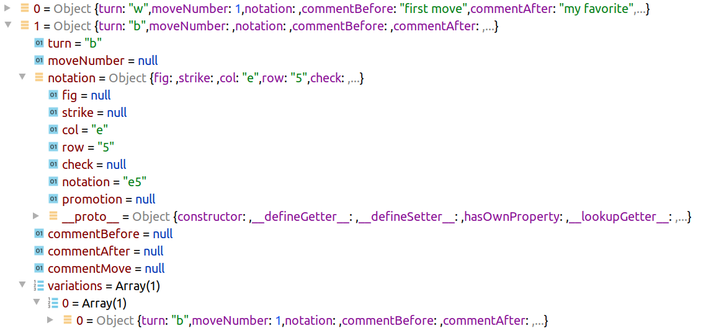

# pgn-parser

Javascript library to allow reading of a PGN (Portable Game Notation) chess game notation, and providing the result as JSON. 

## What is it?

[PGN](http://www.saremba.de/chessgml/standards/pgn/pgn-complete.htm) is a shortcut for [portable game notation](https://en.wikipedia.org/wiki/Portable_Game_Notation). It was developed in 1993. It helps standardize how chess games were notated, so that computer programs like the [PgnViewerJS](https://github.com/mliebelt/PgnViewerJS)  could be developed. PGN is the standard to keep chess games forever. There are huge databases available like those from https://lichess.org.

## Who needs it?

Everyone that wants to implement chess software and has to read PGN notation. The library is a runtime component to be included in the usual way.

    import parser from '@mliebelt/pgn-parser'

## How to install it?

    npm i @mliebelt/pgn-parser --save

## How to use it?

Look at the many test cases that show how to use it. Here is an example:

    import parser from '@mliebelt/pgn-parser'
    let moves = parser.parse("1. {first move} e4! {my favorite} e5 (1... c5!?)")
    moves[0].moveNumber
    
It does not have an API, just a JSON structure that has to be read then.

## References

* [pegjs](https://github.com/pegjs/pegjs) Parser Generator implemented in Javascript. Used for regenerating the javascript library completely by an automatic build.
* [PGN Specification](http://www.saremba.de/chessgml/standards/pgn/pgn-complete.htm): PGN (Portable Game Notation) specification, there the section 8.2. This parser currently does **not** implement the section 8.1, the tags.
* [NAG Specification](http://en.wikipedia.org/wiki/Numeric_Annotation_Glyphs) Definition of the NAGs (Numeric Annotation Glyphs)
